# 🤖 AI Career Guidance & Placement Platform

<p align="center">
  <strong>AI-powered career discovery, resume intelligence, skill-gap analysis, learning roadmaps, interview preparation, and placement support — in one full-stack web platform.</strong>
</p>

<p align="center">
  
  
  
  
  
  
  
  
</p>

---

## 📌 Overview
live link:https://ai-career-guidance-platform-1.onrender.com

**AI Career Guidance & Placement Platform** is a full-stack career-support web application designed to help students and job seekers understand their career direction, evaluate their skills, improve their resumes, prepare for interviews, discover relevant opportunities, and follow structured learning roadmaps.

The platform brings together multiple stages of the career journey:

> **Profile → Resume → Career Recommendation → Skill Gap → Learning Roadmap → Interview Preparation → Job Discovery → Placement Readiness**

Instead of providing only static career information, the application combines user profile data, resume-related analysis, skill matching, learning resources, interview practice, job information, recruiter workflows, and an AI career assistant into a single experience.


---

## ✨ Core Capabilities

### 🎯 AI Career Guidance
- Career-role recommendations based on user information and skills.
- Support for multiple technology and career paths.
- Career descriptions, required skills, and structured learning roadmaps.
- Personalized direction for improving employability.

### 📄 AI Resume Analyzer
- Resume upload support for **PDF, DOC, and DOCX** files.
- Resume scoring and analysis workflow.
- Skill extraction and missing-skill identification.
- Resume improvement recommendations.
- ATS-oriented resume improvement concepts.

### 🧩 Skill Gap Analysis
- Compares available user skills with career-specific required skills.
- Separates existing skills from missing skills.
- Calculates learning progress against a selected career path.
- Produces a personalized skill-development direction.

### 📚 Personalized Learning Roadmap
- Career-specific learning paths.
- Structured roadmap stages.
- Topic descriptions for each stage.
- Existing vs. missing skill tracking.
- Progress calculation based on matched skills.
- Learning notes support for individual skills.

### 🎤 AI Mock Interview
- Technical and HR-style interview questions.
- Answer submission workflow.
- Communication, confidence, technical, and grammar evaluation fields.
- Overall interview score calculation.
- Interview feedback and preparation tips.

### 💼 Job Discovery & Placement Support
- Job listings.
- Job detail pages.
- Job search.
- Recommended jobs.
- Saved jobs.
- Job application workflow.
- Placement-readiness information.

### 🏢 Recruiter Module
- Recruiter dashboard.
- Job posting workflow.
- Job management.
- Applicant viewing.
- Candidate shortlisting.
- Job deletion workflow.

### 🔐 Authentication & Account Security
- Student registration and login.
- Session-based authentication.
- Google OAuth sign-in.
- Logout.
- Forgot-password workflow.
- Email OTP verification.
- Password reset workflow.

### 🤖 AI Career Assistant
- Authenticated career assistant endpoint.
- Gemini-powered conversational responses.
- Short, student-friendly answers.
- Technical questions can receive concise explanations and examples.

### 📊 Student Dashboard
- Profile overview.
- Resume score.
- Interview score.
- Placement-related metrics.
- Job application information.
- Career and skill progress.

---

## 🧠 Platform Workflow

```text
                    ┌─────────────────────┐
                    │   Student / User    │
                    └──────────┬──────────┘
                               │
                               ▼
                    ┌─────────────────────┐
                    │ Register / Login    │
                    │ Google OAuth        │
                    └──────────┬──────────┘
                               │
                               ▼
                    ┌─────────────────────┐
                    │   Student Profile   │
                    └──────────┬──────────┘
                               │
                ┌──────────────┼──────────────┐
                ▼              ▼              ▼
        ┌─────────────┐ ┌─────────────┐ ┌──────────────┐
        │   Resume    │ │   Career    │ │ AI Assistant │
        │  Analysis   │ │ Recommendation│ │   Gemini     │
        └──────┬──────┘ └──────┬──────┘ └──────────────┘
               │               │
               └───────┬───────┘
                       ▼
              ┌──────────────────┐
              │  Skill Gap       │
              │  Analysis        │
              └────────┬─────────┘
                       │
                       ▼
              ┌──────────────────┐
              │ Learning Roadmap │
              │ & Progress       │
              └────────┬─────────┘
                       │
             ┌─────────┴──────────┐
             ▼                    ▼
      ┌──────────────┐     ┌──────────────┐
      │ Mock         │     │ Job Search & │
      │ Interview    │     │ Applications │
      └──────┬───────┘     └──────┬───────┘
             │                    │
             └──────────┬─────────┘
                        ▼
              ┌──────────────────┐
              │ Placement        │
              │ Readiness        │
              └──────────────────┘
```

---

## 🏗️ Architecture

The application follows a modular Flask architecture with separate route modules, templates, static assets, database access, and configuration.

```text
AI-Career-Guidance-Platform/
│
├── app.py
├── config.py
├── .gitignore
│
├── database/
│   └── db.py
│
├── routes/
│   ├── auth.py
│   ├── student.py
│   ├── resume.py
│   ├── interview.py
│   ├── jobs.py
│   └── recruiter.py
│
├── templates/
│   ├── index.html
│   ├── dashboard.html
│   ├── login.html
│   ├── register.html
│   ├── profile.html
│   ├── resume.html
│   ├── skill_gap.html
│   ├── learning.html
│   ├── learning_notes.html
│   ├── interview.html
│   ├── jobs.html
│   ├── placement.html
│   ├── forgot_password.html
│   ├── verify_otp.html
│   └── reset_password.html
│
├── static/
│   ├── *.css
│   ├── *.js
│   ├── images/
│   └── uploads/
│
├── ml/
│   └── Machine-learning / intelligence components
│
└── uploads/
    └── User-uploaded files
```

---

## 🛠️ Technology Stack

| Layer | Technology |
|---|---|
| Backend | Python, Flask |
| Database | MySQL |
| Frontend | HTML5, CSS3, JavaScript |
| UI Icons | Font Awesome |
| Authentication | Flask sessions, Google OAuth |
| AI Assistant | Google Gemini API |
| Email | Gmail SMTP |
| Job Data | Adzuna API integration |
| File Processing | PDF / DOC / DOCX upload workflow |
| Architecture | Modular Flask routes / Blueprints |
| Version Control | Git & GitHub |

---

## 🔐 Authentication Flow

The platform supports both traditional authentication and Google-based authentication.

### Standard Authentication

```text
Register
   ↓
User Account
   ↓
Login
   ↓
Session Created
   ↓
Dashboard
```

### Password Recovery

```text
Forgot Password
       ↓
Enter Registered Email
       ↓
Generate OTP
       ↓
Send OTP through Email
       ↓
Verify OTP
       ↓
Create New Password
       ↓
Return to Login
```

### Google OAuth

```text
Login with Google
       ↓
Google Authorization
       ↓
OAuth Callback
       ↓
User Information
       ↓
Session
       ↓
Dashboard
```

---

## 📄 Resume Analysis Flow

```text
Upload Resume
      ↓
Validate File Type
      ↓
Secure Filename
      ↓
Save Resume
      ↓
Analyze Resume
      ↓
Extract Skills
      ↓
Calculate / Display Resume Score
      ↓
Identify Missing Skills
      ↓
Generate Recommendations
```

Supported resume formats:

- `.pdf`
- `.doc`
- `.docx`

---

## 🧩 Skill Gap & Learning Engine

The learning module maintains career-specific information such as:

- Career description
- Required skills
- Learning roadmap
- Roadmap topics
- Existing skills
- Missing skills
- Completion progress

The application compares normalized user skills against required career skills and calculates progress using the number of matched skills.

### Example

```text
Target Career
     │
     ├── Required Skills
     │      ├── Python
     │      ├── SQL
     │      ├── Git
     │      ├── Docker
     │      └── Cloud
     │
     └── User Skills
            ├── Python       ✓
            ├── SQL          ✓
            ├── Git          ✓
            ├── Docker       ✗
            └── Cloud        ✗

                ↓

        Skill Gap Identified
                ↓
        Personalized Roadmap
```

---

## 🎤 Interview Preparation

The interview module provides:

- Common HR questions
- Technical questions
- Mock interview mode
- Answer submission
- Communication score
- Confidence score
- Technical score
- Grammar score
- Overall score
- Improvement feedback
- Interview preparation tips

The interview result is designed to give users a structured view of areas they can improve before placement interviews.

---

## 💼 Job & Recruiter Ecosystem

### Student Side

Students can:

- Browse jobs
- View job details
- Search jobs
- View recommended opportunities
- Save jobs
- Remove saved jobs
- Apply for jobs

### Recruiter Side

Recruiters can:

- View recruiter dashboard
- Post jobs
- View posted jobs
- View applicants
- Shortlist candidates
- Delete jobs

This creates a two-sided placement workflow connecting **job seekers and recruiters** within the same platform architecture.

---

## 🤖 Gemini AI Assistant

The platform includes an authenticated AI career assistant powered by the Gemini API.

The assistant is designed for:

- Career questions
- Technical questions
- Interview preparation
- Short explanations
- Student-friendly guidance

The application sends a constrained prompt so that responses remain concise and focused on the student's question.

> **Important:** API keys must be stored in environment variables and must never be committed to GitHub.

---

## 🌐 Important Application Routes

The application includes workflows such as:

| Route | Purpose |
|---|---|
| `/` | Landing / Home page |
| `/login` | User login |
| `/register` | User registration |
| `/logout` | Logout |
| `/login/google` | Google OAuth login |
| `/google/callback` | Google OAuth callback |
| `/dashboard` | Student dashboard |
| `/profile` | Student profile |
| `/resume` | Resume workflow |
| `/skill-gap` | Skill-gap analysis |
| `/career` | Career recommendation |
| `/learning` | Personalized learning |
| `/learning/notes` | Learning notes |
| `/interview` | Interview preparation |
| `/jobs` | Job discovery |
| `/placement` | Placement information |
| `/forgot-password` | Password recovery |
| `/verify-otp` | OTP verification |
| `/reset-password` | Password reset |
| `/ai-assistant` | Gemini AI assistant |

---

## 📁 Frontend Structure

The UI is separated into dedicated stylesheets and JavaScript files for major application areas.

### CSS Modules

Examples include:

```text
career.css
dashboard.css
forgot_password.css
interview.css
jobs.css
learning.css
login.css
placement.css
profile.css
register.css
reset_password.css
resume.css
skill_gap.css
style.css
```

### JavaScript Modules

Examples include:

```text
career.js
dashboard.js
forgot_password.js
interview.js
jobs.js
learning.js
learning_notes.js
login.js
placement.js
profile.js
register.js
reset_password.js
resume.js
skill_gap.js
verify_otp.js
```

This separation keeps page-specific UI behavior maintainable and easier to extend.

---

## ⚙️ Local Setup

### 1. Clone the repository

```bash
git clone https://github.com/YOUR-USERNAME/YOUR-REPOSITORY.git
cd AI-Career-Guidance-Platform
```

### 2. Create a virtual environment

#### Windows

```bash
python -m venv venv
venv\Scripts\activate
```

#### macOS / Linux

```bash
python3 -m venv venv
source venv/bin/activate
```

### 3. Install dependencies

If the project contains a `requirements.txt` file:

```bash
pip install -r requirements.txt
```

Otherwise install the required packages used by the application and then generate the dependency file:

```bash
pip freeze > requirements.txt
```

### 4. Configure environment variables

Create a `.env` file locally.

Example:

```env
SECRET_KEY=your_secret_key

MYSQL_HOST=localhost
MYSQL_USER=root
MYSQL_PASSWORD=your_mysql_password
MYSQL_DB=ai_career_platform

GOOGLE_CLIENT_ID=your_google_client_id
GOOGLE_CLIENT_SECRET=your_google_client_secret

GEMINI_API_KEY=your_gemini_api_key

ADZUNA_APP_ID=your_adzuna_app_id
ADZUNA_APP_KEY=your_adzuna_app_key

MAIL_USERNAME=your_email@gmail.com
MAIL_PASSWORD=your_gmail_app_password
```

**Never commit `.env` to GitHub.**

### 5. Configure MySQL

Create the application database:

```sql
CREATE DATABASE ai_career_platform;
```

Then configure the database credentials through environment variables.

### 6. Run the Flask application

```bash
python app.py
```

Open:

```text
http://127.0.0.1:5000/
```

---

## 🔒 Security Checklist Before GitHub Push

Before pushing this project to a public repository:

- [ ] Remove all API keys from source code.
- [ ] Remove Google OAuth client secrets from source code.
- [ ] Remove Gmail passwords / app passwords from source code.
- [ ] Remove database passwords from source code.
- [ ] Keep `.env` in `.gitignore`.
- [ ] Add a safe `.env.example`.
- [ ] Remove private uploaded resumes and personal files.
- [ ] Remove unnecessary `__pycache__` folders.
- [ ] Do not commit generated `.pyc` files.
- [ ] Rotate any credential that has already been exposed.

### Recommended `.gitignore`

```gitignore
.env
.env.*
!.env.example

__pycache__/
*.pyc
*.pyo

venv/
.venv/

instance/

uploads/
static/uploads/

*.log

.DS_Store
Thumbs.db
```

---

## 🧪 Development Notes

For local development, Flask debug mode can be useful. For production deployment, use a production WSGI server and set:

```text
DEBUG=False
```

Sensitive configuration should be supplied through the hosting platform's environment-variable settings rather than hard-coded in Python files.

---

## 🚀 Production Deployment

The application can be prepared for deployment on platforms such as:

- Render
- Railway
- PythonAnywhere
- AWS
- Azure
- Google Cloud
- Other platforms supporting Python/Flask

A typical deployment architecture is:

```text
GitHub Repository
       │
       ▼
Cloud Web Service
       │
       ├── Flask Application
       │
       ├── Environment Variables
       │
       └── Production WSGI Server
                │
                ▼
             MySQL
```

For production:

1. Configure environment variables.
2. Configure a cloud MySQL database.
3. Disable Flask debug mode.
4. Configure the Google OAuth redirect URI for the production domain.
5. Configure Gmail SMTP credentials securely.
6. Configure Gemini and Adzuna API credentials.
7. Use persistent storage or object storage for uploaded files.
8. Configure a production WSGI server.

---

## 📸 Project Screenshots

Add your GitHub screenshots here after uploading them to a repository folder such as `screenshots/`.

Example:


## 📸 Screenshots

### Home Page
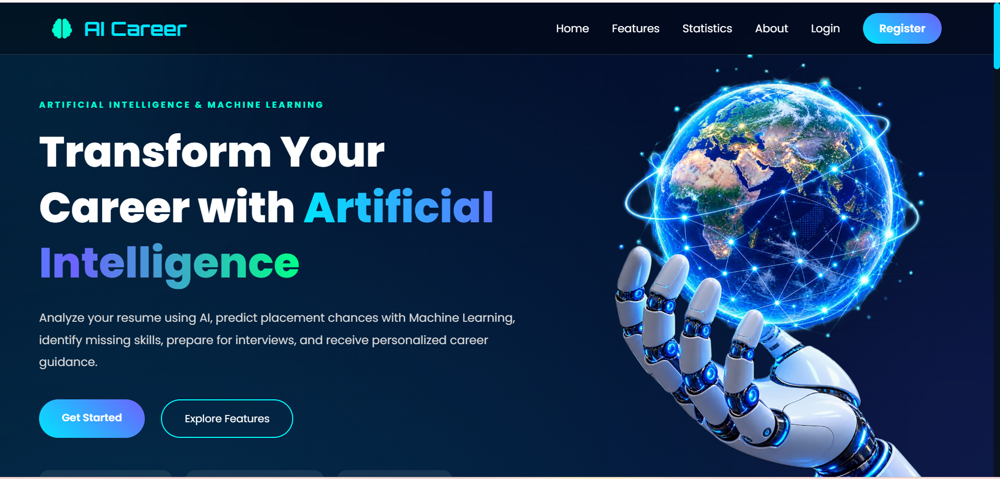
### Login Page
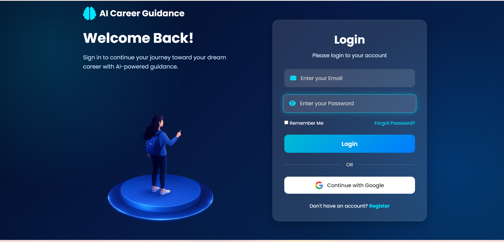
### Register Page
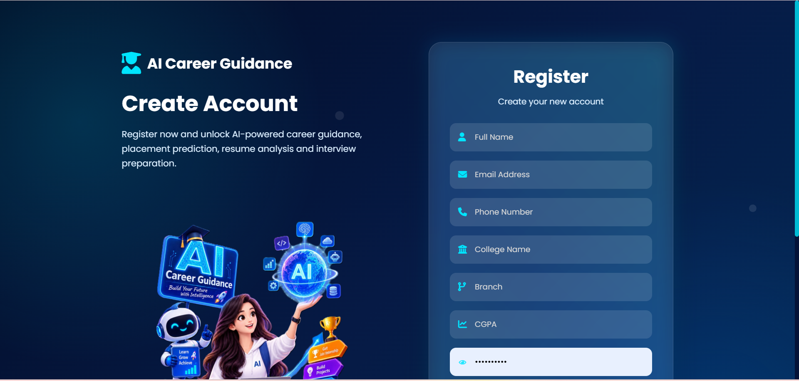
### Dashboard
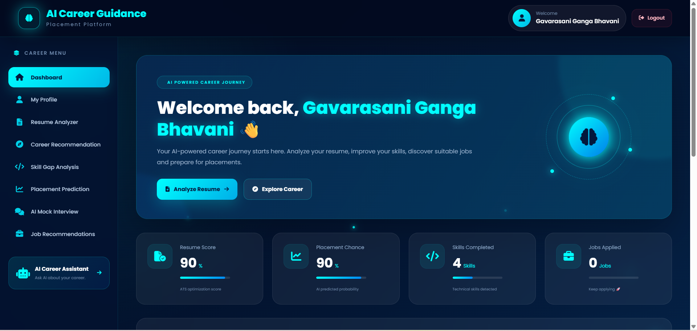

### Resume Analyzer
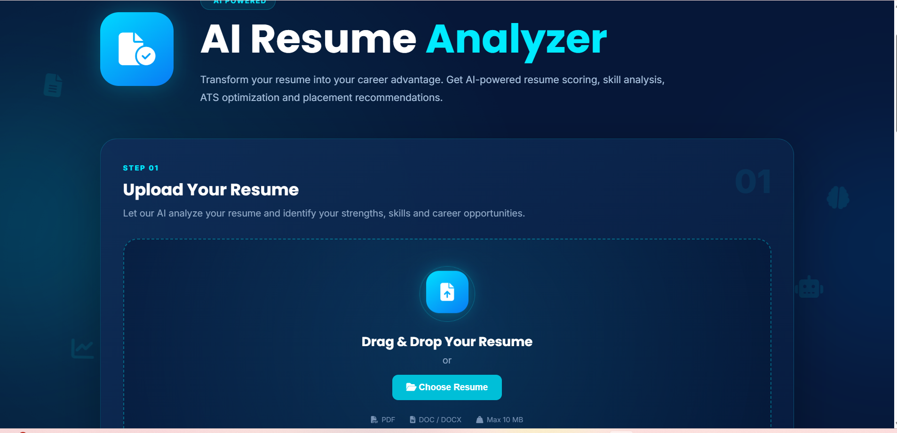
### career recommendation Page
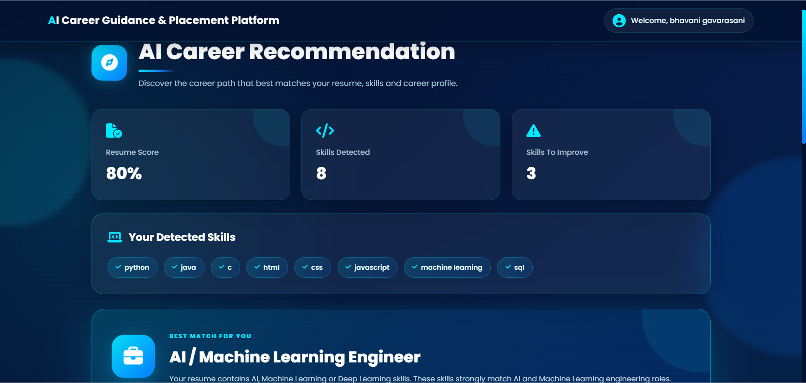


### Skill Gap Analysis
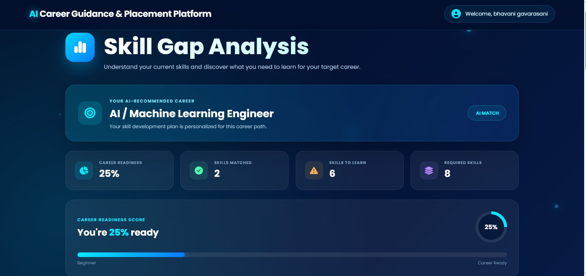
### placement prediction Page
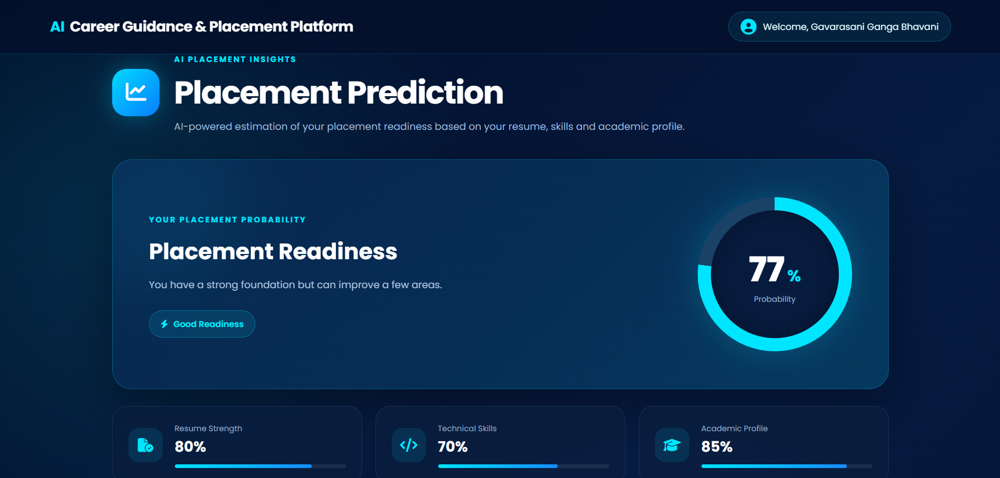


### Learning Roadmap
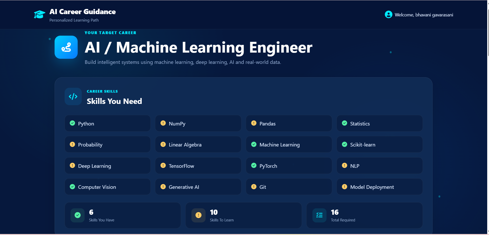

### Mock Interview
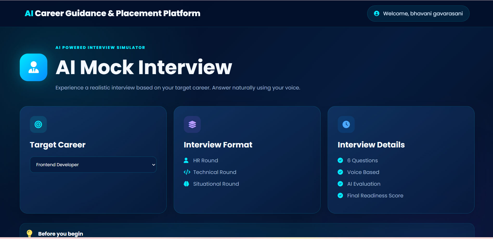

### Job Portal
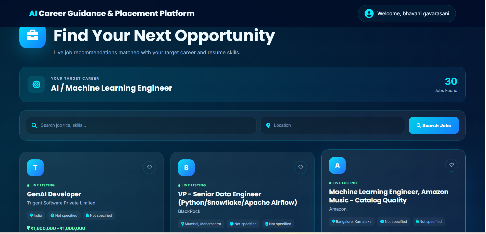
### AI Assistant Page
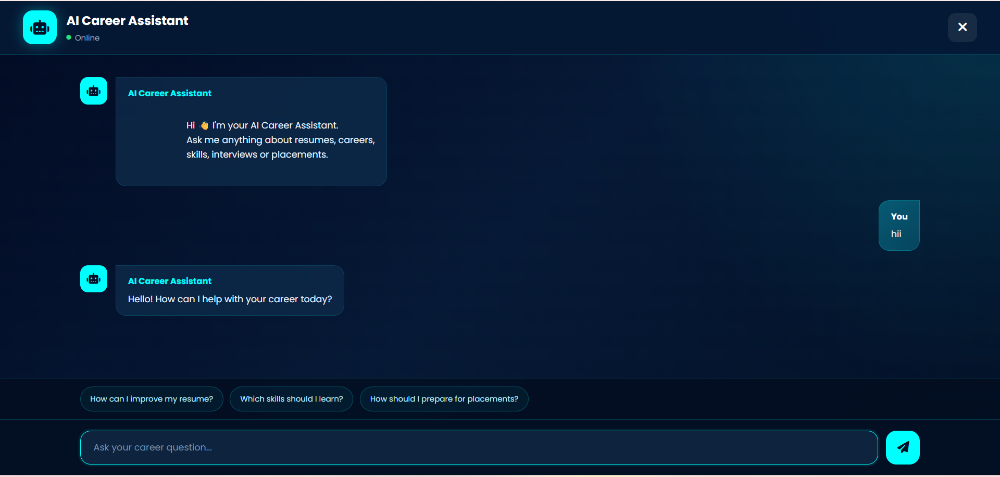


---

## 🗂️ Module Summary

| Module | Description |
|---|---|
| Authentication | Registration, login, logout, Google OAuth |
| Password Recovery | Email OTP verification and reset |
| Student Dashboard | Career and placement overview |
| Profile | Student information and profile management |
| Resume Analyzer | Upload, score, skills, recommendations |
| Career Guidance | Career recommendation and role selection |
| Skill Gap | Existing vs missing skills |
| Learning | Career-specific roadmap and progress |
| Interview | Mock interview and scoring |
| Jobs | Search, recommendations, saved jobs, applications |
| Recruiter | Job posting and applicant management |
| AI Assistant | Gemini-powered career conversation |
| Placement | Placement-readiness information |

---

## 🎯 Project Objectives

The project is designed around five primary objectives:

### 1. Career Clarity
Help students identify suitable career directions based on their skills and interests.

### 2. Employability Analysis
Analyze resumes and identify technical skill gaps that may affect job readiness.

### 3. Structured Learning
Convert skill gaps into a practical, career-oriented learning roadmap.

### 4. Interview Readiness
Provide mock interview practice, scoring, feedback, and preparation guidance.

### 5. Placement Support
Connect career preparation with job discovery, applications, and recruiter workflows.

---

## 🔮 Future Enhancements

Potential future improvements include:

- Advanced NLP-based resume parsing.
- Real ATS keyword analysis.
- ML-based career recommendation models.
- Personalized job matching using embeddings.
- Real-time job aggregation.
- Resume builder with multiple professional templates.
- Video-based mock interviews.
- Speech-to-text interview analysis.
- Sentiment and communication analysis.
- Recruiter authentication and role-based authorization.
- Admin dashboard and analytics.
- Notification system.
- Course/resource recommendation engine.
- Progress history and learning streaks.
- Docker containerization.
- CI/CD pipeline.
- Automated testing.
- Cloud object storage for resumes.
- Production-grade logging and monitoring.

---

## 🧪 Suggested Testing Strategy

A production-ready version can be tested across:

```text
Authentication
 ├── Registration
 ├── Login
 ├── Google OAuth
 ├── Logout
 └── Password Reset

Resume
 ├── PDF Upload
 ├── DOC/DOCX Upload
 ├── Invalid File
 └── Resume Analysis

Career
 ├── Career Recommendation
 ├── Skill Matching
 ├── Skill Gap
 └── Learning Roadmap

Interview
 ├── Question Loading
 ├── Answer Submission
 ├── Score Calculation
 └── Feedback

Jobs
 ├── Job Listing
 ├── Search
 ├── Save / Remove
 └── Apply

Recruiter
 ├── Job Posting
 ├── Applicant Listing
 ├── Shortlisting
 └── Job Management
```

---

## 📌 Repository Hygiene

For a clean professional GitHub repository, the following should **not** be committed:

```text
.env
private credentials
database passwords
OAuth client secrets
Gmail app passwords
API keys
personal resumes
personal profile images
__pycache__
*.pyc
temporary files
debug logs
```

Keep only reusable source code, templates, static assets, safe documentation, and sanitized sample data.

---

## 👨‍💻 Author

**Bhavani**

Full-Stack Developer | Python & Flask | AI Applications | Web Development

---

## ⭐ Why This Project?

This project demonstrates how a modern career platform can combine:

**Web Development + Database Systems + Authentication + AI APIs + Resume Intelligence + Skill Analysis + Learning Systems + Interview Preparation + Job Workflows**

It is designed as an end-to-end portfolio project rather than a single-purpose AI demo.

---

## 📜 License

This project is intended for educational, portfolio, and demonstration purposes.

If you plan to distribute or deploy the project publicly, add an appropriate open-source license such as MIT and update this section accordingly.

---

<p align="center">
  <strong>🚀 AI Career Guidance & Placement Platform</strong><br>
  Helping students move from career uncertainty to placement readiness.
</p>
